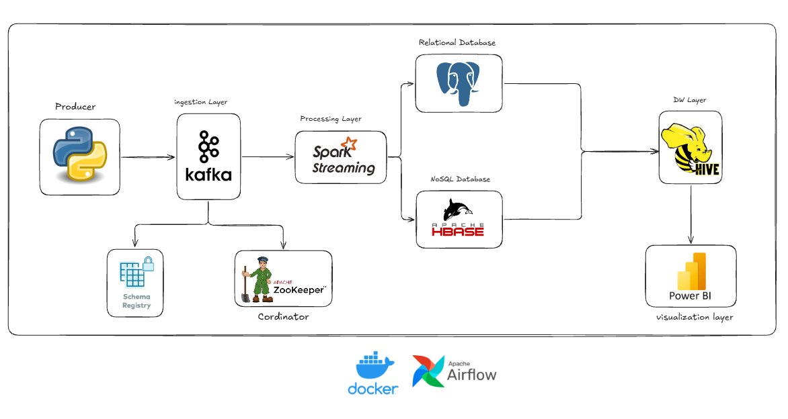
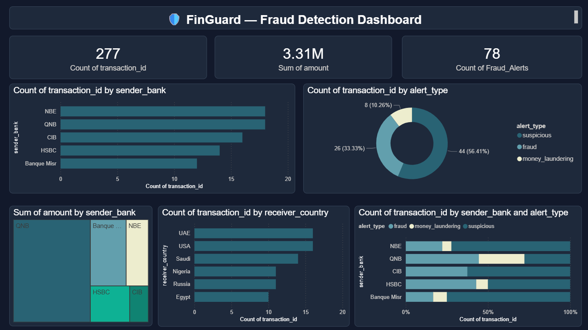

# 🛡️ FinGuard — Real-Time Financial Fraud Detection Pipeline

> A production-grade streaming data pipeline that detects financial fraud in real time,
> built on the modern Big Data stack and fully containerised with Docker Compose.


---

## Architecture Overview
Transaction Producer → Kafka → ┬→ Spark Structured Streaming → Console/HBase
├→ HBase Consumer (NoSQL)
├→ Hive Consumer  (Data Warehouse)
└→ PostgreSQL Consumer (Relational)
Airflow orchestrates health checks and reporting every 5 minutes.

---

## System Architecture




---


## Tech Stack

| Layer | Technology | Purpose |
|---|---|---|
| Ingestion | Apache Kafka 7.5 | Real-time transaction message bus |
| Processing | Apache Spark 3.5.1 | Distributed fraud classification |
| Storage (NoSQL) | Apache HBase 1.4 | Low-latency columnar storage |
| Storage (Warehouse) | Apache Hive 3.1.3 | Batch analytics on HDFS |
| Storage (Relational) | PostgreSQL 15 | Structured fraud alerts |
| Orchestration | Apache Airflow 2.8.1 | Pipeline automation & monitoring |
| Infrastructure | Docker Compose | One-command deployment |


---


## Dashboard Preview



> Real-time fraud detection dashboard built with Power BI, connected directly 
> to the PostgreSQL `finguard` database. Shows live transaction counts, 
> fraud distribution, and high-risk country analysis.


----

## Quick Start

```bash
git clone https://github.com/mahmoudel-awam/finguard-project.git
cd finguard-project/infrastructure
docker-compose up -d
```

Wait ~60 seconds for all containers to become healthy, then:

```bash
# Terminal 1 — start the transaction producer
python ingestion/transaction_producer.py

# Terminal 2 — start the Spark fraud detector
docker exec -it finguard-spark-master spark-submit \
  --master spark://spark-master:7077 \
  --jars /opt/spark/extra-jars/spark-sql-kafka-0-10_2.12-3.5.1.jar \
  /opt/spark/apps/fraud_detector.py

# Terminal 3 — start the PostgreSQL consumer
python consumers/consumer.py
```

## Fraud Detection Rules

| Priority | Condition | Classification |
|---|---|---|
| 1 | Amount > 50,000 EGP | MONEY LAUNDERING |
| 2 | Type = fraud | FRAUD DETECTED |
| 3 | Type = money_laundering | MONEY LAUNDERING |
| 4 | Type = suspicious | SUSPICIOUS |
| 5 | Receiver country: Russia / Nigeria | HIGH RISK COUNTRY |
| 6 | All others | NORMAL |

> Rules are evaluated in priority order — first match wins.

## Project Structure
ingestion/          Kafka producer — synthetic Egyptian bank transactions
with weighted risk distribution (70% normal, 5% laundering)
processing/         Spark Structured Streaming jobs — core detection engine
reads from Kafka, classifies every transaction in real time
consumers/          Three independent Kafka consumers writing to different backends
each with its own group_id — zero interference between them
orchestration/      Airflow DAGs — health checks, reporting, schema initialisation
pipeline runs every 5 minutes with automatic retry on failure
infrastructure/     Docker Compose (12 services, 1 bridge network: finguard-net)
Custom Spark image with pre-loaded Kafka JARs from Maven Central
docs/               Setup guide and architecture screenshots

## Services & Ports

| Service | Port | UI |
|---|---|---|
| Kafka (external) | 29092 | — |
| Kafka (internal) | 9092 | — |
| Spark Master | 7077 | localhost:8080 |
| HBase Thrift | 9090 | localhost:16010 |
| Hive JDBC | 10000 | localhost:10002 |
| Airflow | — | localhost:8088 |
| HDFS NameNode | — | localhost:9870 |
| PostgreSQL | 5432 | — |

## Author

**Mahmoud Ramdan** — Aspiring Data Engineering   
Built as a capstone project demonstrating end-to-end real-time data pipeline design.
