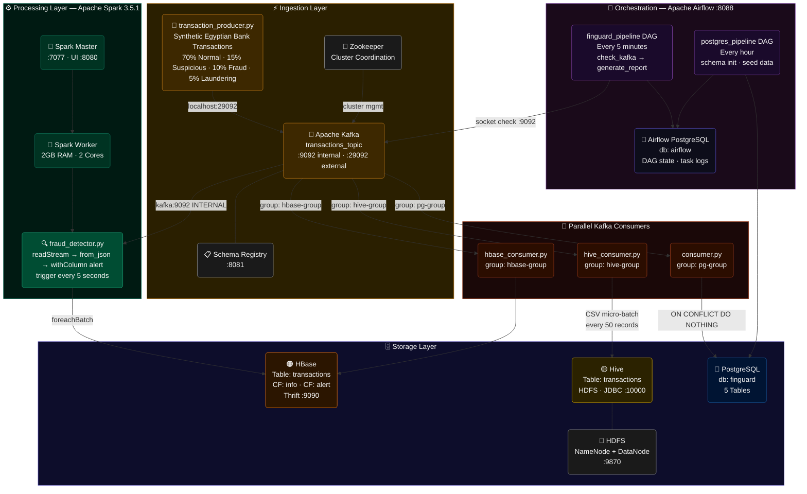

# FinGuard — System Architecture

## Data Flow Diagram

---

## Engineering Logic — 3 Key Design Decisions

### 1. Why Three Independent Consumers Instead of One?
Each consumer has its own `group_id`, meaning Kafka delivers the same message to all three simultaneously with zero interference. This gives us **three different storage backends optimised for three different query patterns** — HBase for millisecond point lookups by `transaction_id`, Hive for heavy batch analytics across millions of records, and PostgreSQL for structured relational queries and reporting. One consumer failing never affects the others.

### 2. Why Spark Structured Streaming Instead of a Simple Loop?
A Python `while True` loop processes one message at a time on one machine. Spark's `readStream` distributes the workload across the entire cluster — every micro-batch is split across all worker cores in parallel. The `trigger(processingTime="5 seconds")` means Spark collects 5 seconds of transactions, processes them all simultaneously as a batch, then immediately starts the next window. This design scales horizontally — add more workers, get more throughput, zero code changes.

### 3. Why Two Kafka Ports (9092 and 29092)?
This is the most common Docker networking mistake in Kafka deployments. Services **inside** Docker (Spark, consumers) reach Kafka via the internal Docker bridge network on `kafka:9092`. Services **outside** Docker (the Python producer running on your laptop) cannot use that hostname, so Kafka exposes a second listener on `localhost:29092` mapped to the host machine. Without this dual-listener configuration, either the producer cannot publish or Spark cannot consume — never both working at the same time.

---

## Service Ports Reference

| Service | Internal Port | External Port | UI |
|---|---|---|---|
| Kafka | 9092 | 29092 | — |
| Zookeeper | 2181 | 2181 | — |
| Spark Master | 7077 | 7077 | :8080 |
| HBase Thrift | 9090 | 9090 | :16010 |
| Hive JDBC | 10000 | 10000 | :10002 |
| HDFS NameNode | 9000 | 9000 | :9870 |
| Airflow | 8080 | 8088 | :8088 |
| PostgreSQL (finguard) | 5432 | 5432 | — |
| PostgreSQL (airflow) | 5432 | 5433 | — |
